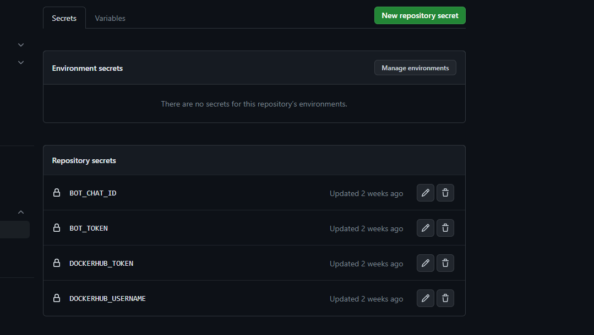
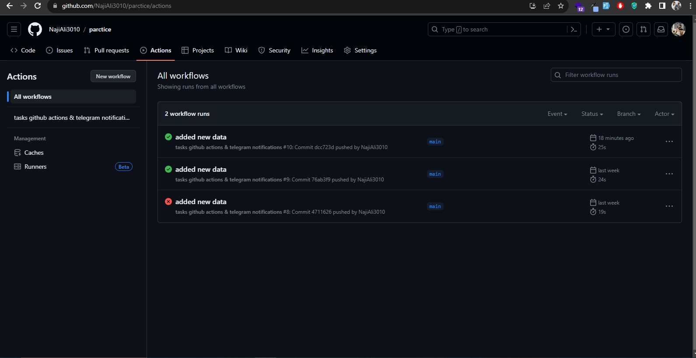
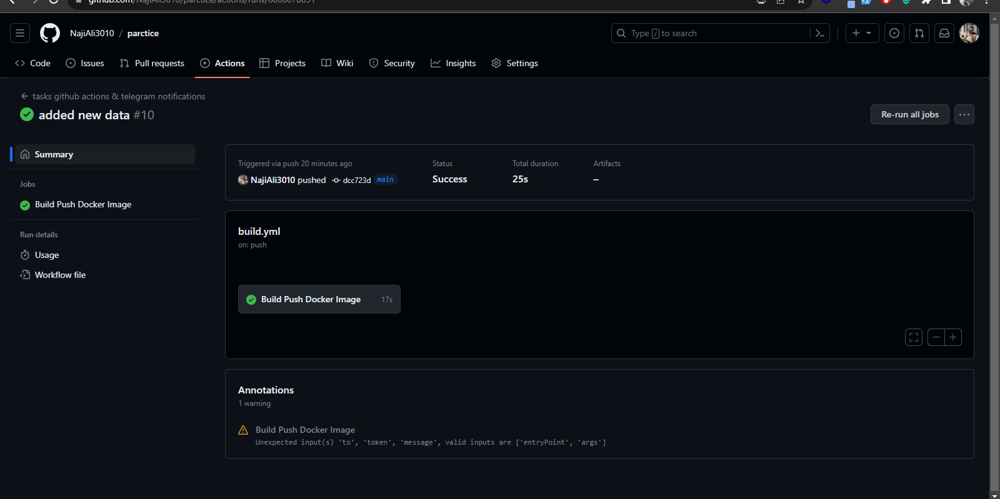
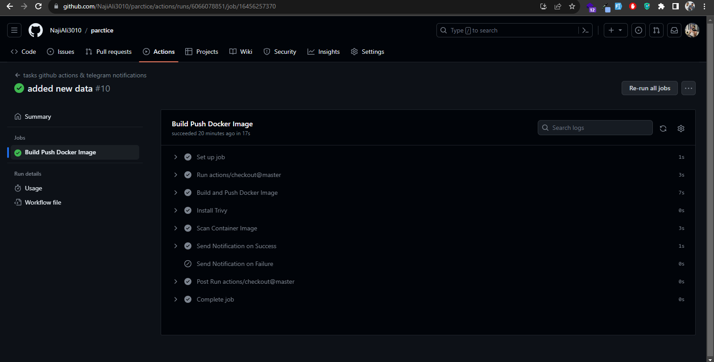
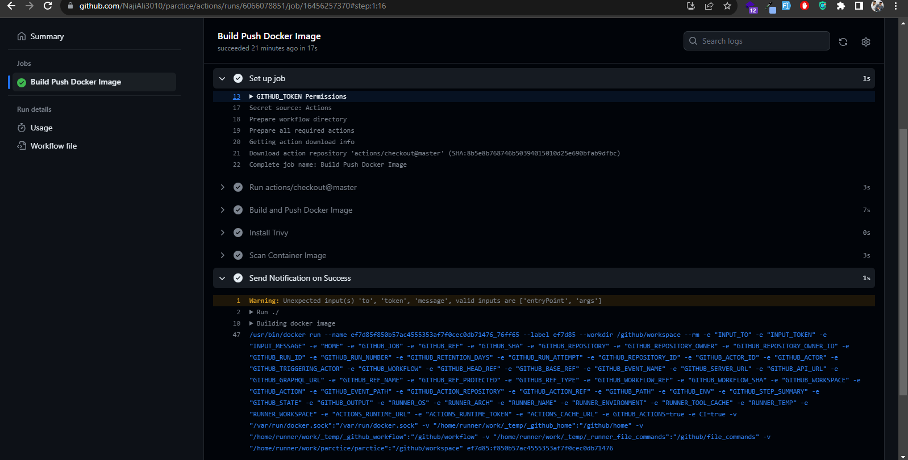
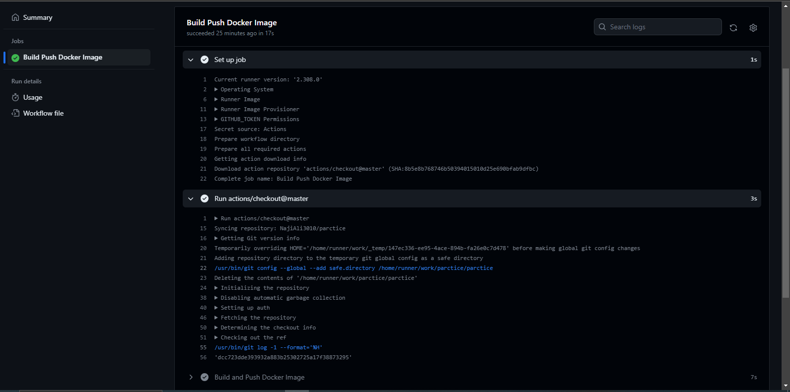
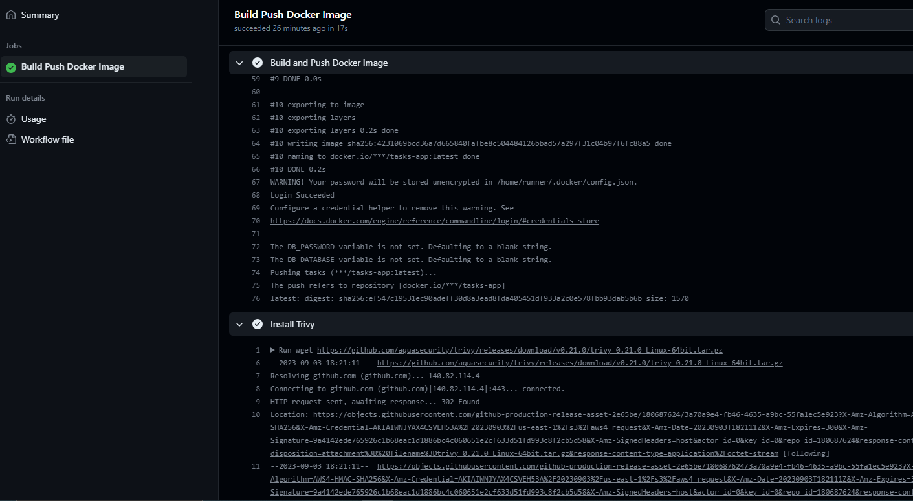
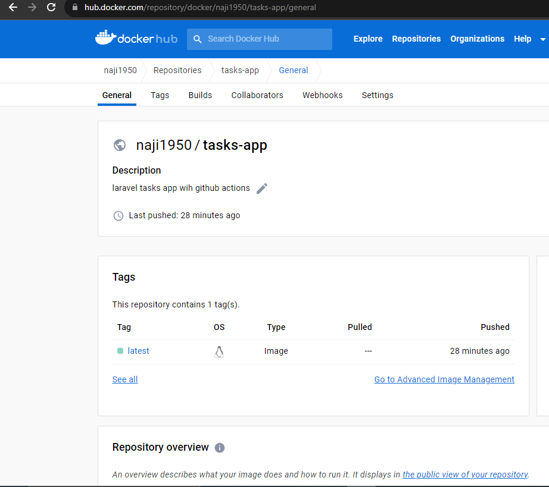
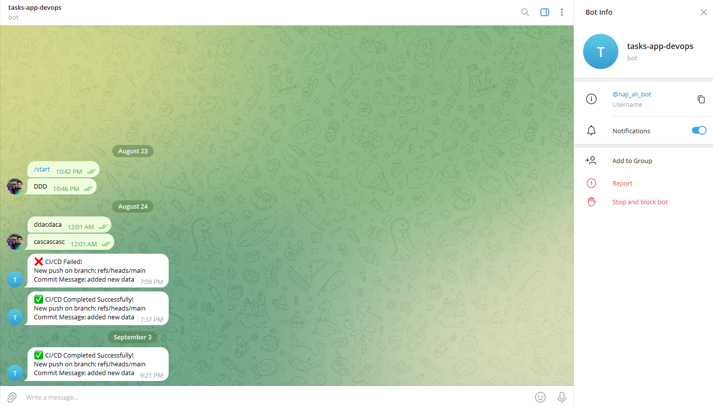
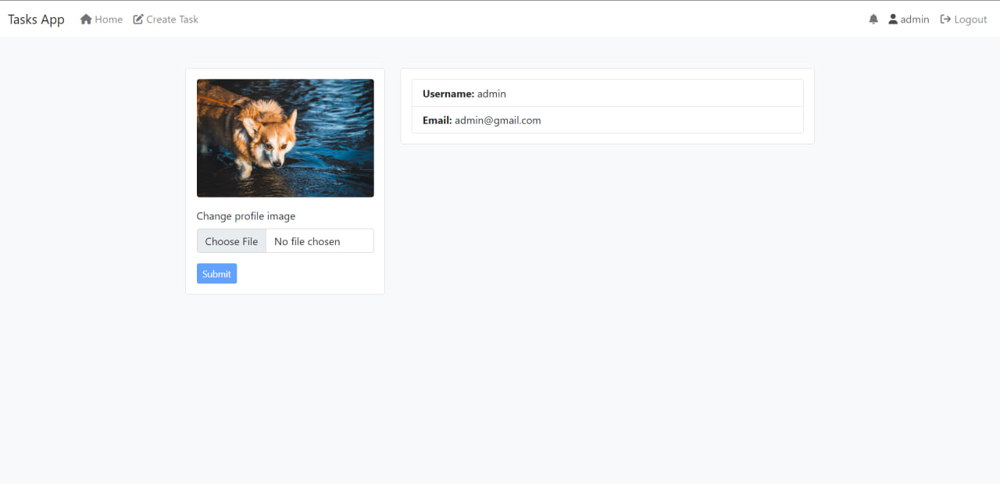

# Tasks Web App 


Веб приложение представляет собой простое приложение с php laravel и vuejs, веб-приложение 
- это приложение tasks. пользователь может создать account в приложении, и затем он будет 
- перенаправлен на страницу, на которой отображаются 
tasks от других пользователей. сначала ему нужно выбрать, какую задачу он хочет создать, выбрав category и
- создать task или много tasks по своему усмотрению.


<details>
 <summary><h2>Используемый</h2></summary>

- Laravel
- Php 8
- Docker & docker compose
- VueJs
- Database MySQL
- Nginx
- Prometheus
- Node exporter
- Grafana

</details>


<details>
 <summary><h2>Github actions с уведомлениями telegram-бота </h2></summary>

1. я создал .github/workflows/build.yml для actions
2. 
```bash
 
name: tasks github actions & telegram notifications
on: [push]
jobs:

  build:
    name: Build Push Docker Image
    runs-on: ubuntu-latest
    steps:
      - uses: actions/checkout@master


      - name: Build and Push Docker Image
        run: |
          docker-compose build
          echo ${{ secrets.DOCKERHUB_TOKEN }} | docker login -u ${{ secrets.DOCKERHUB_USERNAME }} --password-stdin
          docker-compose push
        env:
          DOCKER_BUILDKIT: 1


      # Container Security Scanning
      - name: Install Trivy
        run: |
          wget https://github.com/aquasecurity/trivy/releases/download/v0.21.0/trivy_0.21.0_Linux-64bit.tar.gz
          tar zxvf trivy_0.21.0_Linux-64bit.tar.gz
          sudo mv trivy /usr/local/bin/

      - name: Scan Container Image
        run: trivy image ${{ secrets.DOCKERHUB_USERNAME }}/tasks-app:latest\


      # Sending success or failure notifications to Telegram
      - name: Send Notification on Success
        if: success()
        uses: ./
        with:
          to: ${{ secrets.BOT_CHAT_ID }}
          token: ${{ secrets.BOT_TOKEN }}
          message: |
            ✅ CI/CD Completed Successfully!
            New push on branch: ${{ github.ref }}
            Commit Message: ${{ github.event.head_commit.message }}

      - name: Send Notification on Failure
        if: failure()
        uses: ./
        with:
          to: ${{ secrets.BOT_CHAT_ID }}
          token: ${{ secrets.BOT_TOKEN }}
          message: |
            ❌ CI/CD Failed!
            New push on branch: ${{ github.ref }}
            Commit Message: ${{ github.event.head_commit.message }}


```
## Обзор рабочего процесса
Этот автоматизированный рабочий процесс запускается каждый раз, когда в репозитории обнаруживается новое событие push. Он состоит из следующих основных компонентов:

## Задача: Создание и отправка Docker-образа
Эта задача управляет всем процессом CI/CD и включает в себя несколько ключевых этапов:

1. Получение кода:
Извлекается код репозитория, что гарантирует использование последней версии для последующих действий.

2. Установка Trivy:
Trivy, надежный сканер уязвимостей для образов контейнеров, устанавливается в рабочей среде процесса.

3. Создание и отправка Docker-образа:
Создается Docker-образ и далее отправляется с использованием Docker Compose. В этот процесс включается использование учетных данных Docker Hub, безопасно сохраненных как секреты GitHub.

4. Сканирование образа на уязвимости:
Созданный Docker-образ подвергается сканированию на наличие уязвимостей с использованием Trivy. Этот этап помогает обеспечить целостность образа.

5. Уведомление об успешном завершении:
Если процесс создания и отправки Docker-образа успешно завершается, уведомление об успешной работе CI/CD отправляется в указанный канал Telegram. В уведомлении содержится подробная информация о успешной работе CI/CD, новом событии push и связанном с ним комментарии к коммиту.

6. Уведомление об ошибке:
В случае сбоя во время создания Docker-образа или процесса отправки, уведомление об ошибке отправляется в тот же Telegram-канал. Уведомление содержит информацию о статусе сбоя процесса CI/CD, а также соответствующие данные о новом событии push и комментарии к коммиту.

## Принцип работы

1. **Запуск по событию push:** Каждый раз, когда в репозитории происходит новое событие push, автоматически активируется рабочий процесс GitHub Actions.

2. **Координация задач:** Задача рабочего процесса управляет созданием, отправкой и сканированием Docker-образов, используя Docker Compose и Trivy.

3. **Уведомления в Telegram:** В зависимости от результата CI/CD процесса, на указанный Telegram-канал отправляется соответствующее уведомление (об успешном завершении или ошибке).

Используя этот рабочий процесс, я могу оптимизировать мой CI/CD конвейер, усилить безопасность Docker-образов путем сканирования уязвимостей и быть в курсе текущего состояния моих развертываний благодаря уведомлениям в Telegram.


2. я создал Dockerfile для github actions


```bash
FROM appleboy/drone-telegram:1.3.9-linux-amd64

COPY entrypoint.sh /entrypoint.sh
RUN chmod +x /entrypoint.sh

WORKDIR /github/workspace

ENTRYPOINT ["/entrypoint.sh"]

```

Код создает Docker-образ для выполнения операций с Telegram.
Он использует базовый образ `appleboy/drone-telegram`, копирует исполняемый скрипт `entrypoint.sh` в образ, делает его исполняемым и устанавливает рабочую директорию. При запуске контейнера из этого образа выполняется скрипт `entrypoint.sh`.


3. Я создал файл `entrypoint.sh`:

```bash
#!/bin/sh
set -eu

export GITHUB="true"

[ -n "$*" ] && export TELEGRAM_MESSAGE="$*"

/bin/drone-telegram
```

Этот скрипт служит в качестве точки входа в Docker-контейнер и выполняет следующие действия:

1. Установка переменных окружения: Он устанавливает переменную окружения GITHUB в значение true, что указывает на выполнение в контексте GitHub.

2. Условное определение сообщения для Telegram: Если переданы аргументы командной строки, то значение этих аргументов устанавливается в переменную окружения TELEGRAM_MESSAGE.

3. Запуск `/bin/drone-telegram`: Скрипт запускает исполняемый файл `/bin/drone-telegram`, выполняя соответствующие действия.

Таким образом, этот скрипт подготавливает окружение, обрабатывает сообщение для Telegram (если оно указано), и запускает операции с использованием `/bin/drone-telegram`.












</details>





Prometheus -это система мониторинга и алертинга с открытым исходным кодом, 
разработанная для сбора и анализа метрик из различных источников. Он предоставляет 
возможности мониторинга, отслеживания и анализа производительности приложений, систем
и сетевых ресурсов.Прометей разработан для работы в распределенных средах и имеет модель сбора данных,
основанную на "отправителе-получателе". Он использует специальные агенты, называемые "экспортерами" (exporters),
чтобы собирать метрики из различных компонентов системы, таких как веб-серверы, базы данных, приложения и 
другие сервисы. Экспортеры преобразуют метрики в формат, понятный Прометею, и отправляют их на центральный
сервер Прометея.

Node Exporter -это инструмент с открытым исходным кодом, который собирает системные метрики
с узловых машин и предоставляет их в виде экспонируемых (экспортируемых) метрик в Прометей (Prometheus).
Узловой экспортер запускается на каждой машине, которую вы хотите мониторить, и собирает различные
метрики о системе, такие как использование ЦП, память, дисковое пространство, сетевые интерфейсы и 
другие характеристики узла. Он предоставляет эти метрики в Прометей, который сохраняет их во временном
ряду для последующего анализа и визуализации. Узловой экспортер работает по протоколу HTTP и предоставляет 
метрики в формате, который понимает Прометей. Прометей может собирать метрики с нескольких экспортеров 
Node Exporter в распределенной среде и использовать их для мониторинга и анализа состояния узловых машин.

Grafana (Графана) -это платформа для визуализации и мониторинга данных с открытым исходным кодом. 
Она позволяет создавать красивые и информативные графики, диаграммы и панели управления для 
отображения данных из различных источников.
Grafana поддерживает множество источников данных, включая базы данных, сервисы 
мониторинга (например, Прометей), системы журналирования и другие. Она обладает широким набором
возможностей визуализации, позволяя настраивать графики, добавлять аннотации, фильтровать данные 
и создавать интерактивные панели управления.
Одной из ключевых особенностей Grafana является ее гибкость. Она предоставляет широкий выбор панелей и
компонентов для создания настраиваемых и адаптивных дашбордов. Вы можете отображать несколько графиков и 
диаграмм на одной панели, настраивать цвета и стили, добавлять текстовые блоки и метки для лучшего понимания данных.


 <details>
 <summary><h2>Шаги</h2></summary>


1. показатели маршрута для конечной точки prometheus

```bash
Route::middleware([RequestsCountMiddleware::class])->group(function () {
    Route::get('/metrics',[PrometheusController::class, 'myMetrics']);
});

```


2. В классе PrometheusController я создал функцию моих metrics
```bash

class PrometheusController extends Controller
{
    public function myMetrics(Request $request)
    {
        DB::connection()->enableQueryLog();
        $collectorRegistry = app(CollectorRegistry::class);

        //memory usage metric
        $memoryUsage = memory_get_usage(true);
        $gauge = $collectorRegistry->getOrRegisterGauge('app', 'memory_usage_bytes', 'Memory usage in bytes');
        $gauge->set($memoryUsage);

        // Count the number of registered users
        $usersRegistered = User::count();
        $gauge = $collectorRegistry->getOrRegisterGauge(
            'tasks',
            'users_registered_count',
            'Count the registered users'
        );
        $gauge->set($usersRegistered);


        // Count the number of created tasks
        $usersRegistered = Task::count();
        $gauge = $collectorRegistry->getOrRegisterGauge(
            'tasks',
            'tasks_created_count',
            'Count the created tasks'
        );
        $gauge->set($usersRegistered);


        // Count the number of created categories
        $usersRegistered = Task::count();
        $gauge = $collectorRegistry->getOrRegisterGauge(
            'tasks',
            'categories_created_count',
            'Count the created categories'
        );
        $gauge->set($usersRegistered);

        // Track cache hits
        $cacheHits = Cache::get('cache_hits', 0);
        $cacheHitsCounter = $collectorRegistry->getOrRegisterCounter(
            'tasks',
            'cache_hits_total',
            'count of cache hits'
        );
        $cacheHitsCounter->incBy($cacheHits);


        $renderer = new RenderTextFormat();
        $result = $renderer->render($collectorRegistry->getMetricFamilySamples());

        return response($result, 200)->header('Content-Type', RenderTextFormat::MIME_TYPE);
    }
}

```
3.я создал middleware для metrics запросов

```bash
 
class RequestsCountMiddleware
{
    private CollectorRegistry $registry;

    public function __construct(CollectorRegistry $registry)
    {
        $this->registry = $registry;
    }

    /**
     * @throws MetricsRegistrationException
     */
    public function handle(Request $request, Closure $next)
    {
        $startTime = microtime(true);

        $response = $next($request);

        $duration = microtime(true) - $startTime;
        $path = $request->getPathInfo();
        $method = $request->getMethod();
        $statusCode = $response->getStatusCode();
        $content = $response->getContent();

        $requestCounter = $this->registry->getOrRegisterCounter(
            'tasks',
            'request_count',
            'Count the number of requests',
            ['path', 'method', 'status_code']
        );
        $requestCounter->incBy(1, [$path, $method, (string) $statusCode]);

        return $response;
    }
}
```

4. Dockerfile
```bash 
FROM php:8.2.0-fpm

# Install system dependencies
RUN apt-get update && apt-get install -y \
    libzip-dev \
    zip \
    libpq-dev \
    libfreetype6-dev \
    libjpeg62-turbo-dev \
    libpng-dev \
    curl \
    && docker-php-ext-install zip pdo_mysql pdo_pgsql

# Install GD extension
RUN docker-php-ext-configure gd --with-freetype --with-jpeg \
    && docker-php-ext-install -j$(nproc) gd

# Install Node.js and npm
RUN curl -fsSL https://deb.nodesource.com/setup_14.x | bash -
RUN apt-get install -y nodejs

# Install Composer
RUN curl -sS https://getcomposer.org/installer | php -- --install-dir=/usr/local/bin --filename=composer

WORKDIR /var/www/html

# Copy application files
COPY . .

# Set max_execution_time
RUN echo "php_value[max_execution_time] = 120" >> /usr/local/etc/php/conf.d/docker-php-max-execution-time.ini

# Install PHP dependencies
RUN composer install

# Install Node.js dependencies and build assets
RUN npm install

```

5. docker-compose.yml контейнеры (tasks , database ,nginx , prometheus , node-exporter, grafana)

```bash
version: '3.8'

networks:
    default:
        external: true
        name: tasks_default

services:
    tasks:
        build:
            context: .
            dockerfile: Dockerfile
        container_name: tasks
        volumes:
            - .:/var/www/html
        depends_on:
            - database
            - prometheus

    nginx:
        image: nginx:latest
        container_name: nginx
        ports:
            - '8000:8000'
        volumes:
            - .:/var/www/html
            - ./Monitor/nginx.conf:/etc/nginx/conf.d/default.conf
        depends_on:
            - tasks


    database:
        image: mysql:8.0
        container_name: database
        ports:
            - '3306:3306'
        environment:
            MYSQL_ROOT_PASSWORD: '${DB_PASSWORD}'
            MYSQL_ROOT_HOST: "%"
            MYSQL_DATABASE: '${DB_DATABASE}'
            MYSQL_PASSWORD: '${DB_PASSWORD}'
        volumes:
            - tasks_mysql_data:/var/lib/mysql

    prometheus:
        image: prom/prometheus
        container_name: prometheus
        ports:
            - "9090:9090"
        volumes:
            - ./Monitor:/etc/Monitor
            - ./Monitor/scrape_config.yml:/etc/Monitor/scrape_config.yml
        command:
            - --config.file=/etc/Monitor/scrape_config.yml
        depends_on:
            - node-exporter


    node-exporter:
        image: prom/node-exporter
        container_name: node-exporter
        ports:
            - "9100:9100"


    grafana:
        image: grafana/grafana
        container_name: grafana
        ports:
            - "3000:3000"
        depends_on:
            - prometheus


```


6. Node Exporter Configuration
```bash
# MySQL Exporter Configuration
[client]
user=root
password=naji123
host=mysql
database=tasks

# MySQL Exporter Collectors
collect[] = "status"
collect[] = "processlist"
collect[] = "performance_schema.events_statements_summary_by_digest"
collect[] = "performance_schema.events_statements_summary_global_by_digest"
collect[] = "performance_schema.events_waits_summary_global_by_event_name"
collect[] = "performance_schema.file_summary_by_event_name"
collect[] = "performance_schema.table_io_waits_summary_by_table"
collect[] = "performance_schema.table_lock_waits_summary_by_table"
collect[] = "performance_schema.table_lock_waits_summary_by_table"
collect[] = "performance_schema.table_statistics"
collect[] = "performance_schema.index_statistics"


```

7. nginx Configuration
```bash
server {
    listen 8000;
    index index.php index.html;
    root /var/www/html/public;

    location / {
        try_files $uri $uri/ /index.php?$query_string;
    }

    location ~ \.php$ {
        fastcgi_pass tasks:9000;
        fastcgi_index index.php;
        fastcgi_param SCRIPT_FILENAME $document_root$fastcgi_script_name;
        include fastcgi_params;
    }
}


```

8.  Node Exporter and Prometheus Configuration
```bash
global:
  scrape_interval: 15s
  scrape_timeout: 10s

scrape_configs:
  - job_name: 'nginx'
    metrics_path: '/metrics'
    static_configs:
      - targets: ['nginx:8000']

  - job_name: 'node-exporter'
    static_configs:
      - targets: [ 'node-exporter:9100' ]


```
</details>


<details>
  <summary><h2>контейнеры docker</h2></summary>


</details>


<details>
  <summary><h2>убедитесь, что веб-приложение получает metrics в route localhost:8000/metrics</h2></summary>


</details>

<details>
  <summary><h2>Prometheus</h2></summary>


</details>

<details>
  <summary><h2>Node exporter </h2></summary>


</details>

<details>
  <summary><h2>Grafana</h2></summary>


</details>
